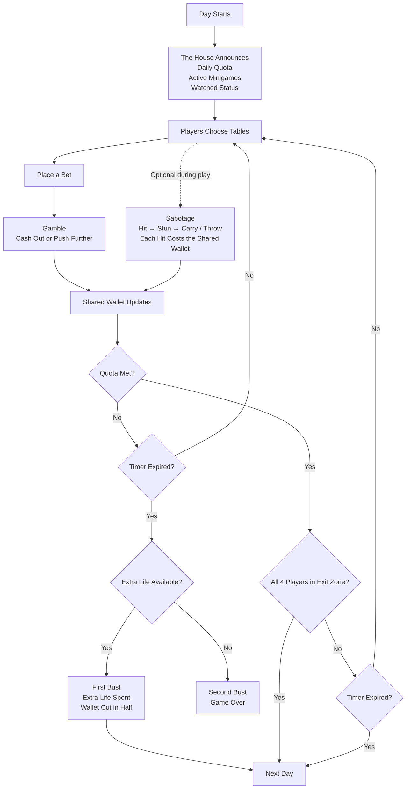
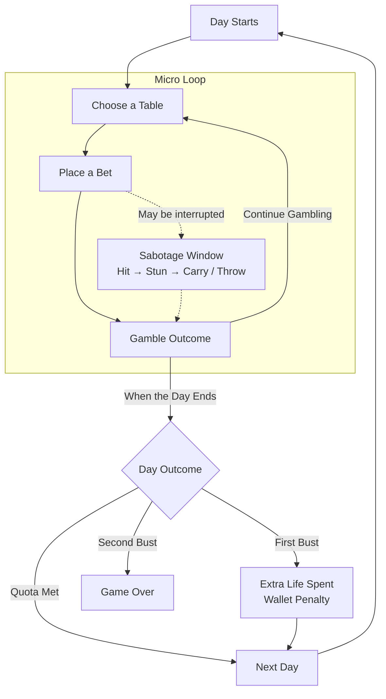

# Fowl Play

## 1. High Concept Statement

Fowl Play is a first-person cooperative party game for four players trapped by a cursed chicken-themed casino contract after one friend signs what appears to be a free wings-for-life deal and shares the wings with the group. Sharing one wallet, the players must gamble through casino minigames, manage escalating risks, and stop reckless teammates from risking the team's money long enough to meet the daily quotas and eventually void the contract before The House claims them.

## 2. Formal Elements

### Players

Four players participate in a LAN-based cooperative multiplayer session. All players work toward the same overall objective, but individual gambling decisions can affect the entire team's shared resources.

### Objectives

The main objective is to survive the full run and eventually void the contract by meeting the required daily quotas.

Each day, players must earn enough money to meet the day's quota before the five-minute timer expires. The team must manage its shared wallet carefully because gambling losses and unnecessary interference affect everyone.

### Rules

1. All four players share one wallet.
2. Winnings and losses from minigames affect the shared wallet.
3. Only one player may occupy a minigame table at a time.
4. Players can hit teammates to stun them, but every hit also removes a small amount of money from the shared wallet.
5. A stunned player cannot act while being carried and can only recover after being dropped or thrown.
6. The team must meet the daily quota before the day ends.
7. Once the quota is met, all four players may gather in the exit zone to end the day early.
8. If the quota is not met and the extra life is still available, the extra-life penalty is triggered and the shared wallet is cut in half.
9. A second failed quota after the extra life has already been used ends the run.

### Procedures

Each day follows this general sequence:

The House begins each day by announcing the daily quota, active minigames, and Watched status. Players then choose tables, place bets, gamble, and decide whether to cash out or push further while the shared wallet changes based on their results.

Teammates may interfere during play using the hit, stun, and carry mechanics. Each hit also costs the shared wallet. If the quota has been met, the team may end the day early by gathering all four players in the exit zone or continue until the timer expires. If the timer expires without the quota being met, the extra-life rule is applied. The first failure spends the extra life and cuts the wallet in half, while another failure after the extra life has already been used ends the run.

### Resources

| Resource | Function |
|---|---|
| Shared Wallet | Used for bets and affected by gambling outcomes, sabotage, and the failed-quota penalty. |
| Time | The five-minute countdown limits each day. |
| Extra Life | Allows the team to continue after one failed quota. |
| Stunned/Carried Player State | A stunned teammate can temporarily be removed from active play by being carried away from a table. |

### Conflict

The main conflicts are:

- The daily quota versus the five-minute time limit.
- The desire to win more money versus the risk of losing the team's shared wallet.
- Individual gambling decisions versus the team's collective objective.
- Players trying to stop reckless teammates while knowing that interference also costs the team money.
- The escalating daily quota as the run continues.
- The changing risk created by the Watched player's Blessed/Cursed status.

### Boundaries

The game takes place within one chicken-themed casino room, including its integrated break/safe corner.

The game is also bounded by the daily structure. Each day has:

- A specific quota
- A five-minute time limit
- A rotating set of active minigames
- A Watched status

The current project scope deliberately limits the game to one casino room rather than multiple floors or rooms.

### Outcome

#### Success

The team meets the daily quota. Once the quota is reached, the day ends either when the timer expires or when all four players gather in the exit zone to finish the day early. The team then advances to the next day.

#### Penalty

The team fails to meet the quota while the extra life is still available. The extra life is consumed, the shared wallet is cut in half, and the run continues to the next day.

#### Game Over

The team fails another quota after the extra life has already been used. The contract remains in effect and the run ends.

The overall successful outcome of the full run is surviving the required days and earning enough to void the contract.

## 3. Core Gameplay Loop

### Core Loop Diagram

### Core Loop Description

A single pass through Fowl Play's larger gameplay loop begins when a new day starts and The House announces the daily quota, active minigames, and Watched status. Players then choose a table, place a bet, and participate in a casino minigame.

The moment-to-moment micro loop is:

**Choose a Table → Place a Bet → Gamble Outcome → Choose a Table Again**

This loop repeats throughout the day. A sabotage window may interrupt the gambling loop when another player believes a teammate is taking too much risk. That teammate may be hit, stunned, and carried away, but every hit also costs the shared wallet.

At the larger level, the micro loop repeats until the day ends. If the quota is met, the team advances to the next day. A first failed quota spends the team's extra life, applies the wallet penalty, and still leads to the next day. A second failed quota ends the run in Game Over.

The loop is worth repeating because every gambling result affects the same shared wallet that all four players depend on. The rotating active minigames, changing Watched status, escalating daily quota, and ability for teammates to interfere also force the group to keep adjusting its decisions.

### Lab 3 Prototype Connection

The Lab 3 prototype focuses on the Blackjack portion of Fowl Play's larger gambling loop. The current project contains a 3D room with player movement and a Blackjack table, together with Blackjack round logic for dealing the initial cards, choosing Hit or Stand, resolving the dealer's turn, determining a win, loss, Blackjack, or push, and resetting the round.

The current Lab 3 build represents the Blackjack minigame logic that will eventually form part of the **Place a Bet → Gamble Outcome** section of the full Fowl Play core loop. The table interaction and visible Blackjack feedback are not yet fully connected in the current prototype.

## Peer Feedback Revision

- **Feedback received:** Nice
- **Revision made:** None, "everything should be alright", they said